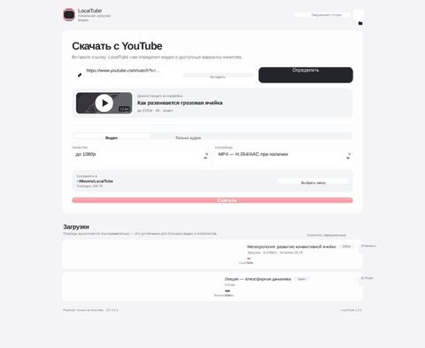
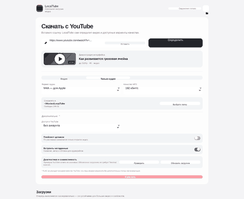

<div align="center">

# 🎬 LocalTube

**Локальный macOS‑сервис для загрузки видео и аудио с YouTube в свою папку — без облака, аккаунта LocalTube и фоновой отправки данных.**

[](https://github.com/f2re/localtube/actions/workflows/ci.yml)
[](https://github.com/f2re/localtube/releases)
[](https://github.com/f2re/localtube)
[](https://github.com/f2re/localtube)
[](LICENSE)
[](https://github.com/yt-dlp/yt-dlp)

</div>

LocalTube превращает `yt-dlp + FFmpeg + Deno` в обычный локальный сервис: вставил ссылку → увидел видео и доступные разрешения → выбрал видео или аудио → файл появился в указанной папке. Интерфейс открывается в браузере, но backend слушает только `127.0.0.1` и не публикуется в локальную сеть.



## ✨ Что умеет

- 🎥 видео в лучшем качестве или с верхним пределом 2160p / 1440p / 1080p / 720p / 480p / 360p;
- 🍎 MP4 с приоритетом нативных H.264/AAC потоков, MKV или исходного контейнера; лишнее перекодирование не навязывается;
- 🎧 аудио M4A, MP3, Opus, FLAC или исходный аудиопоток;
- 📚 плейлисты, очередь, прогресс, скорость, ETA, отмена и история;
- 📁 нативный выбор папки macOS и «Показать в Finder»;
- 🍪 cookies из поддерживаемого браузера или `cookies.txt`, когда видео требует входа;
- 🩺 встроенная диагностика `yt-dlp / FFmpeg / Deno / YouTube`;
- 🔄 безопасное обновление `yt-dlp` из интерфейса и транзакционное обновление всего runtime;
- 📴 после установки UI/backend не требуют npm, pip, Homebrew или внешних JS‑пакетов приложения.



## 🚀 Установка на macOS

1. Скачайте ZIP из **Releases** и распакуйте его Finder.
2. Запустите **`Install LocalTube.app`**. Это основной установщик: он **не открывает Terminal, не запускает zsh и не читает `.zshrc`, Oh‑My‑Zsh, Homebrew shellenv, pyenv и т. п.**
3. При первом запуске установщик скачает подходящие вашему CPU Deno, `yt-dlp_macos`, FFmpeg и FFprobe, проверит SHA‑256, проведёт self-test, установит `~/Applications/LocalTube.app` и запустит локальный LaunchAgent.
4. Дальше открывайте `~/Applications/LocalTube.app` как обычное приложение.

Требования: **macOS 11 Big Sur или новее**, Apple Silicon (`arm64`) либо Intel (`x86_64`), интернет при первой установке. Сам bootstrap‑архив не содержит сторонние runtime‑бинарники: они загружаются для конкретной архитектуры при установке.

> Если macOS предупреждает о приложении от неизвестного разработчика, используйте Finder → правый клик → **Открыть**. Для полностью бесшовной установки через Gatekeeper релиз должен быть подписан Developer ID и нотарифицирован Apple; workflow и инструкция для этого включены в репозиторий.

### Если `.zshrc` сломан

Это не влияет на основной `Install LocalTube.app`. Резервный `INSTALL.command` также сам запускает `/bin/bash --noprofile --norc` в чистом окружении, но **Terminal до запуска `.command` сначала стартует ваш login shell**, поэтому неисправный `.zshrc` может успеть напечатать свои ошибки. Именно поэтому `.app` является штатным способом установки.

Если резервный установщик всё же запускается вручную из zsh, путь должен быть абсолютным или относительным с `./`:

```bash
./INSTALL.command
# либо
/Users/имя/Downloads/LocalTube-macOS-v1.3.0/INSTALL.command
```

`Users/имя/...` без начального `/` — это относительный путь и zsh закономерно его не найдёт.

## 🧱 Как устроено

```text
LocalTube.app
    │ open http://127.0.0.1:<port>/
    ▼
launchd → run_server.sh → Deno → server.ts
                              │
                              ├─ yt-dlp_macos ── YouTube
                              ├─ FFmpeg / FFprobe
                              └─ osascript / Finder
```

Сервис хранится в `~/Library/Application Support/LocalTube/`. LaunchAgent — `~/Library/LaunchAgents/com.localtube.service.plist`. По умолчанию загрузки идут в `~/Movies/LocalTube`; папка меняется из интерфейса.

## 🔐 Безопасность и приватность

Backend привязан только к loopback. API использует случайный локальный токен, проверяет `Host` и `Origin`, CORS не включён. Пользовательский URL проходит allowlist YouTube/youtu.be; команды запускаются через `Deno.Command` без shell-интерполяции. `yt-dlp` всегда получает `--ignore-config`, поэтому случайный глобальный `yt-dlp.conf` не меняет поведение LocalTube.

Deno запускается без `-A`: разрешены файловые операции, необходимые для выбранной пользователем папки/cookies, loopback‑сокет и строго ограниченный набор subprocess. При установке скачанные runtime‑компоненты проверяются по upstream SHA‑256. Сам релиз содержит `MANIFEST.sha256`, а рядом с ZIP публикуется SHA‑256 всего архива.

Подробности: [SECURITY.md](SECURITY.md) и [AUDIT.md](AUDIT.md).

## 🧰 Runtime и обновления

LocalTube предпочитает официальный универсальный `yt-dlp_macos` nightly, официальный Deno для `arm64`/`x86_64` и подписанные macOS‑сборки FFmpeg/FFprobe от Martin Riedl. Если конкретный upstream временно недоступен, bootstrap умеет использовать уже установленный совместимый runtime из стандартных Homebrew/MacPorts/user locations через локальный wrapper. Источник каждой активной компоненты записывается в `runtime/manifest.json`.

Из интерфейса можно безопасно обновить собственный `yt-dlp`. Если используется внешний fallback‑`yt-dlp`, локальное самообновление блокируется — требуется полное обновление runtime, чтобы случайно не менять чужую системную установку.

## 🧪 Проверка и разработка

```bash
./scripts/test.sh
python3 scripts/build_release.py
```

`test.sh` проверяет shell, Bash 3.2‑совместимость, TypeScript/JavaScript, security invariants, universal Mach‑O launcher и структуру релиза. GitHub Actions дополнительно запускает integration test на настоящем **macOS runner**, скачивает runtime тем же installer‑кодом, выполняет Deno/backend self-test и собирает ZIP/DMG.

См. [CONTRIBUTING.md](CONTRIBUTING.md) и [docs/RELEASING.md](docs/RELEASING.md).

## ⚖️ Использование

LocalTube — оболочка над открытыми инструментами и не обходит DRM. Загружайте только материалы, которые вы вправе сохранять; правила платформы и законодательство зависят от юрисдикции и конкретного контента. Проект не связан с YouTube или Google.

## 📄 Лицензия

Код LocalTube — [MIT](LICENSE). Загружаемые сторонние компоненты имеют собственные лицензии; перечень и источники приведены в [THIRD_PARTY.md](THIRD_PARTY.md).
